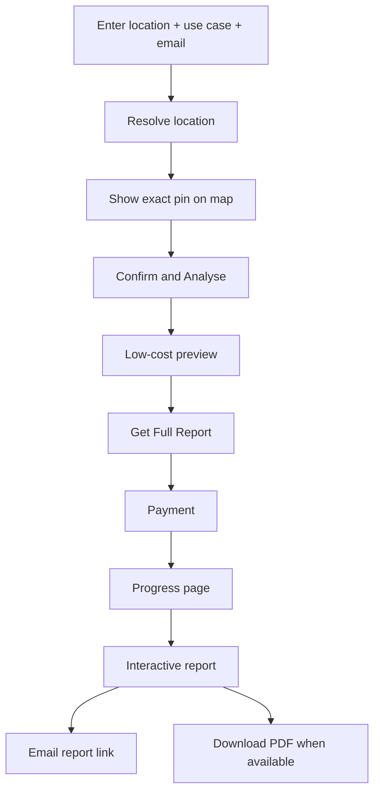

# LocationIQ UX And Report UI Specification

Version: 0.1  
Date: April 25, 2026  
Status: Build-start draft

## 1. UX Principle

The first screen should be the product itself.

The user should feel:

```text
I can drop a pin, tell the app my use case, and get a serious location read without learning a complicated tool.
```

The report should feel like:

```text
A local expert who understands the exact pin, the surrounding locality, and the user's decision context.
```

## 2. End-To-End Customer Flow



## 3. Screen 1: Input

Purpose:

- Capture the minimum needed to begin.

Fields:

| Field | Type | Required | Notes |
|---|---|---|---|
| Location | Text input | Yes | Accept Google Maps link, coordinates, address, landmark, locality. |
| Use case | Chips + free text | Yes | First chips should cover the five launch use-case groups. |
| Email | Email input | Yes | Used for payment continuity and report delivery. |

Primary CTA:

```text
Check Location
```

Use-case chips:

- Buy or rent a home
- Cafe / restaurant / cloud kitchen
- Sports facility
- Gym / fitness studio
- Franchise / storefront

Free-text examples:

- "Buy a 3BHK apartment"
- "Open a pickleball facility"
- "Start a cloud kitchen"
- "Evaluate a gym location"
- "Take a franchise store"

Validation:

- Location cannot be empty.
- Use case cannot be empty.
- Email must be valid.
- If location cannot be resolved, ask for a more precise pin or coordinates.

## 4. Screen 2: Pin Confirmation

Purpose:

- Prevent wrong-location reports before payment.

Required UI:

- Google Map with exact marker.
- Satellite/map toggle.
- Resolved address/locality.
- Exact coordinates.
- Nearest named places as context only.
- Data note if location is approximate.

Primary CTA:

```text
Confirm and Analyse
```

Secondary CTA:

```text
Change Location
```

Copy rules:

- Never rename the pin to the nearest POI.
- Say "near" or "beside" when describing nearby places.
- If the input is a locality/address and not a pin, ask user to confirm/drop marker.

Example:

```text
We found this pin at 18.576742, 73.736961 near Hinjawadi, Pune. The marker below is the location your report will analyse. Nearby named places are shown only for orientation.
```

## 5. Screen 3: Low-Cost Preview

Purpose:

- Build trust before payment without running the full expensive report.

Preview layout:

1. Exact pin mini-map.
2. Use-case lens.
3. Location-character teaser from S2 cell profile.
4. "What the full report will check" list.
5. Locked report modules.
6. Payment CTA.

Preview content:

- Exact coordinate.
- Resolved locality.
- Use-case interpretation question.
- Plain-English built-environment profile such as "office-residential mixed", "residential-support heavy", "sports/leisure visible", or "sparse peri-urban".
- 3-5 lightweight preview signals.
- Source families the full report will examine.
- Expected report depth.

Locked modules:

- Exact pin and plot read
- Catchment and access
- Nearby competitors and anchors
- Public platform signals
- Pricing and spend cues
- Visual evidence pack
- What to verify physically

Primary CTA:

```text
Get Full Report
```

Preview should not:

- Give a final conclusion.
- Show complete competitor tables.
- Show normalized pricing charts.
- Show deep public-web gold extraction.
- Mention raw S2 cells, embeddings, or model scores.
- Use decorative fake visuals.

## 6. Screen 4: Payment

Purpose:

- Convert preview user to paid full report.

Payment page content:

- Report title.
- Location summary.
- Use case.
- Email.
- Price.
- What the report includes.
- Expected generation time range.

Payment success behavior:

- Start report workflow.
- Redirect to progress page.
- Send payment confirmation email if provider supports it.

Payment failure behavior:

- Show retry option.
- Preserve report request.
- Do not start full generation.

## 7. Screen 5: Progress

Purpose:

- Keep the user comfortable while the deep report is generated.

Progress UI:

- Large status headline.
- Progress bar.
- Current stage.
- Completed stages.
- Reassurance copy.
- Email delivery note.

Stage names:

| Stage | User-facing text |
|---|---|
| `resolving_location` | Confirming the exact pin |
| `planning_sources` | Planning the location checks |
| `collecting_map_data` | Reading surrounding map context |
| `collecting_access_data` | Checking travel-time access |
| `collecting_public_web` | Checking public platforms |
| `normalizing_prices` | Normalizing visible prices |
| `generating_visuals` | Building maps and visuals |
| `composing_report` | Writing your location report |
| `validating_report` | Running final quality checks |
| `completed` | Report ready |

Copy:

```text
This can take a few minutes because we are checking the location from multiple angles. You can keep this page open; we will also email the report link when it is ready.
```

Do not show:

- Technical stack details.
- Raw scraper statuses.
- Internal errors.
- Percent values that jump backwards.

## 8. Screen 6: Interactive Report

Report structure:

1. Header and exact pin
2. Reader-first summary
3. Exact pin and plot truth
4. Multi-anchor location story
5. Catchment and reach
6. Arrival and access reality
7. Numbers that make the story real
8. Competition and pricing
9. Spend and convenience signals
10. Locality conditions
11. Visual evidence pack
12. What you should physically verify
13. Compact source notes

Report header:

- Report title
- Use case
- Coordinates
- Locality/city/state
- Generated date/time
- Short data coverage note

Required top actions:

- Email status
- Download PDF when available
- Share/reopen report link
- Contact support

## 9. Report Tone

The report should address the user directly.

Use:

- "You are looking at..."
- "What this means for you..."
- "What you should check..."
- "This currently shows..."
- "Treat this as..."
- "The exact pin is..."

Avoid:

- "As a layman..."
- "This section explains..."
- "The v2/v4 structure..."
- "Evidence strength..."
- "The model concludes..."
- "You should invest/open/buy..."

Tone target:

```text
Plain-English, specific, locally aware, careful with uncertainty, but not timid.
```

## 10. Visual Modules

### 10.1 Exact Pin Map

Must show:

- Exact marker.
- Coordinate.
- Nearby labels.
- Map/satellite context.

If plot highlight is drawn:

- Use a distinct color.
- Caption: "Visual highlight, not legal boundary" unless verified.

### 10.2 Catchment Map

Must show:

- 300m / 1km / 3km / 5km rings where useful.
- 10/15 minute drive or relevant travel-time shapes.
- Important anchors.
- Direct competitors for business use cases.

### 10.3 Arrival Sequence

Must show:

- Main road approach.
- Final turn.
- Entry side if known.
- Drop-off/parking cue where visible.

### 10.4 Competitor Map

Must show:

- Direct competitors.
- Complementary anchors.
- Distance/travel time.
- Platform presence where relevant.

### 10.5 Pricing Chart

Only show comparable normalized pricing.

Required labels:

- Platform.
- Venue.
- Slot duration.
- Unit.
- Normalized value.
- Date checked.

### 10.6 Public Platform Snapshots

Use only where allowed and useful.

Should show:

- Platform name.
- Locality/catchment condition.
- Timestamp.
- Extracted signal.

### 10.7 Field Verification Checklist

Should be purpose-specific.

For sports facility:

- Visit weekday evening.
- Count vehicle stacking.
- Observe entry and drop-off.
- Compare nearby venue occupancy.
- Check rain-day access.
- Confirm visible price/slot assumptions.

## 11. Mobile Behavior

Mobile report must:

- Start with exact pin and summary.
- Keep map controls usable.
- Use horizontal scrolling only inside tables when unavoidable.
- Keep charts readable.
- Collapse long source notes.
- Keep CTA/status visible.

No text should overflow on mobile.

## 12. Empty And Partial Data States

If a source is unavailable:

- Say what could not be checked.
- Say how that affects interpretation.
- Suggest physical verification where useful.

Bad:

```text
No data available.
```

Better:

```text
Public booking pages did not expose comparable slot prices for this pass, so the report does not compare nearby court prices. You should check peak-hour slots manually before treating price as settled.
```

## 13. Report Download

V1 priority is interactive web report.

PDF/download soon after should include:

- Same core content.
- Static map/images where provider terms allow.
- Proper attribution.
- Source notes.
- Download timestamp.

If an interactive visual cannot be reproduced in PDF, use a static image plus caption.

## 14. Support And Recovery UX

Payment succeeded, report failed:

- Show "We could not complete the report automatically."
- Tell user support has been notified.
- Allow retry internally.

Report still running:

- Keep progress state.
- Email when ready.

Pin ambiguity:

- Ask user to confirm or adjust marker before payment.

Public-web collection partial:

- Do not expose raw failure.
- Use natural report note.

## 15. UX Acceptance Criteria

The UX is ready for implementation when:

- User can complete location -> preview -> payment -> progress -> report without login.
- Pin confirmation clearly prevents nearest-POI confusion.
- Preview feels valuable but does not reveal the full paid report.
- Progress page keeps the user comfortable during long generation.
- Report uses direct "you" language.
- Every major report section has at least one visual or number where applicable.
- PDF is treated as follow-on, not blocker for interactive report launch.
