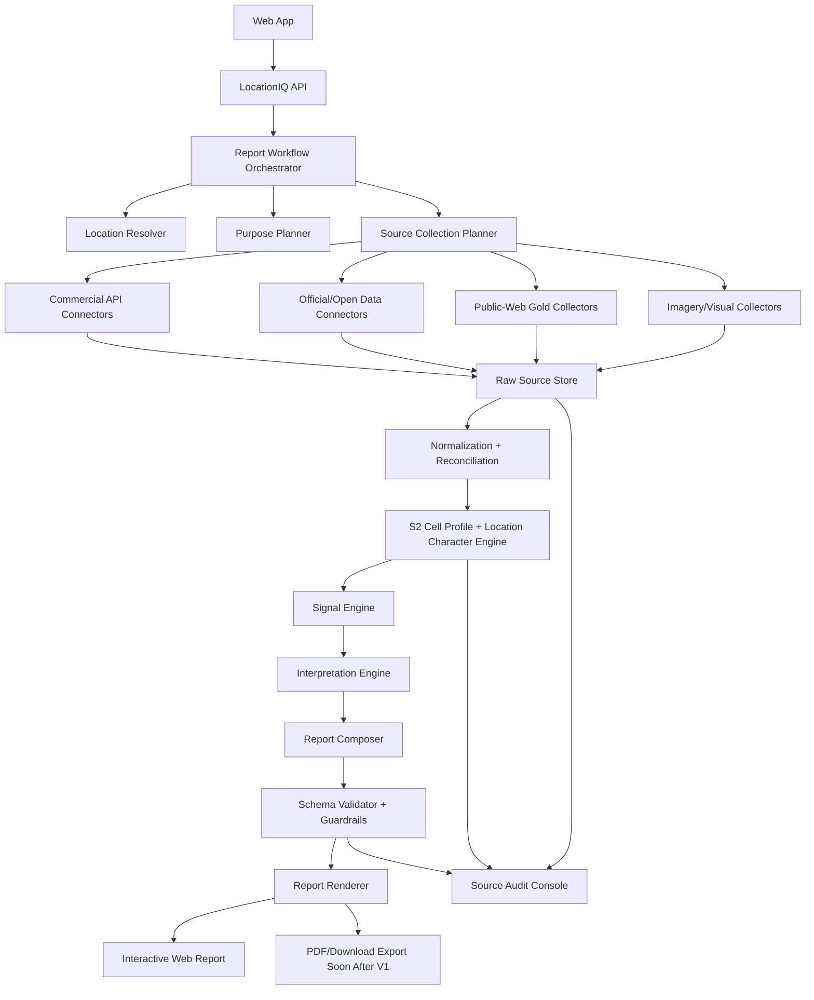

# LocationIQ Technical Specification

Version: 0.1  
Date: April 25, 2026  
Status: Draft for product and engineering review

## 1. Product Contract

LocationIQ helps a user understand a selected location for a selected purpose. It does not tell the user whether to buy, invest, open, proceed, or avoid.

The product accepts:

```text
location + use case + email
```

The product shows a low-cost preview first, then generates the full report after payment.

The product returns:

```text
a reader-first location intelligence report with interpretation, quantified support, visuals, source-aware limitations, and physical verification prompts
```

The exact coordinate is canonical. Nearby named places are context, never identity.

V1 customer experience is no-login. Email plus a secure report token is the customer access model.

## 2. Non-Negotiable Product Invariants

| Invariant | Engineering implication |
|---|---|
| No final verdict | Report generator must block final buy/open/invest/proceed/avoid language. |
| No single overall score | Internal scoring can rank/retrieve signals, but user output cannot collapse the location into one number. |
| Exact pin first | All workflows preserve the raw coordinate and never snap the location identity to the nearest POI. |
| Purpose-aware report | The same location must produce different reports for a home purchase, cafe, gym, pickleball facility, clinic, warehouse, etc. |
| Numbers where applicable | Important claims need metrics, source references, time/radius context, or clear wording that the number is unavailable. |
| Sources woven gracefully | User-facing copy should cite sources naturally in text, table rows, captions, or compact source notes. |
| No user-facing source-quality badges | Do not expose direct/inferred/weak-proxy style labels in the report UI. |
| Public-web gold is first-class | Zomato, Swiggy, Blinkit, Zepto, Playo, Hudle, KheloMore, etc. are usable when pin-conditioned and publicly reachable. |
| Pricing must be normalized | Sports/facility pricing cannot be compared until slot duration and unit are captured. |
| Visuals must explain | Maps, screenshots, charts, and photo prompts should answer user questions, not decorate the report. |
| India-realistic data only | Do not create safety, cleanliness, road-quality, crowd-type, market-gap, or physical-suitability claims from weak data. |

## 3. Canonical Inputs

The input taxonomy is defined in:

- `report-templates/input-taxonomy.yaml`

Minimum request:

```json
{
  "location_input": "https://maps.app.goo.gl/...",
  "use_case_input": "Set up a pickleball facility",
  "email": "customer@example.com"
}
```

Expanded request:

```json
{
  "location_input": "18.576742, 73.736961",
  "purpose_category": "fitness_sports_site",
  "sub_purpose": "pickleball_facility",
  "selected_context": {
    "target_audience": ["office_workers", "families_with_children"],
    "primary_mobility_mode": ["two_wheeler", "car"],
    "daypart_priority": ["weekday_evening", "weekend_morning"],
    "positioning": "mid_market",
    "parking_need": "medium",
    "indoor_outdoor_preference": "outdoor_or_covered"
  }
}
```

Input rules:

- Accept Google Maps link, coordinates, address, dropped pin, landmark, or locality.
- If a maps short link is provided, expand and parse the canonical coordinate when technically possible.
- Do not ask a long questionnaire before preview or payment.
- Infer purpose category and sub-purpose from the selected chip/free-text use case.
- Use purpose defaults when context is not provided.
- Save both raw user input and normalized coordinate.
- Track the selected coordinate separately from any reverse-geocoded address or nearby place.

## 4. Canonical Output

The structured output contract is:

- `report-templates/output-schema.json`

Every report must include:

- metadata
- reader summary
- purpose lens
- exact pin
- multi-anchor story
- catchment and reach
- arrival reality
- key numbers
- competition and pricing
- spend and convenience
- locality conditions
- visual evidence pack
- field verification plan
- source notes

The user-facing report shape is defined in:

- `report-templates/master-report-template.md`
- `report-templates/reader-first-v4-blueprint.md`

## 5. Recommended Technical Stack

### 5.1 Application Layer

| Layer | Technology | Why |
|---|---|---|
| Web app | Next.js + React + TypeScript | Strong report UI, maps, charts, SSR/export-friendly rendering. |
| Map UI | Google Maps JavaScript API | Production report should use Google Maps for user-facing map quality. |
| Visual overlays | deck.gl or Google Maps overlays | Catchments, competitor markers, approach arrows, plot highlights. |
| Charts | ECharts or Recharts | Pricing normalization, source counts, catchment metrics. |
| Backend API | FastAPI + Python | Strong fit for geospatial, data pipelines, structured generation, and scraping workflows. |
| Async orchestration | Temporal | Long-running multi-source report generation with retries, checkpoints, and auditable steps. |
| Browser automation | Playwright | Public-web gold collection, screenshots, and dynamic locality-conditioned surfaces. |
| LLM gateway | OpenAI GPT-5.5 with extra high reasoning by default | High-quality narrative synthesis, structured output, guardrail checks, and report repair. |
| S2 cell engine | S2 Geometry-compatible cell indexing | Multi-resolution location character, source planning, preview support, and similar-location retrieval. |

### 5.2 Data Layer

| Layer | Technology | Why |
|---|---|---|
| Primary DB | Supabase Postgres + PostGIS | Exact pin, catchments, POIs, spatial joins, geometry queries, and managed Postgres operations. |
| Vector/search | Supabase pgvector + Postgres full-text | Evidence retrieval and source-note lookup without adding avoidable complexity. |
| Location embeddings | Supabase pgvector over S2 cell profiles | S2Vec-inspired built-environment embeddings, similar-location retrieval, and report QA. |
| Cache | Redis | API response cache, source fetch cache, workflow locks, rate-limit counters. |
| Object store | Supabase Storage plus S3-compatible storage if needed | Raw source payloads, screenshots, map renders, exports, audit artifacts. |
| Analytics warehouse | BigQuery, Snowflake, or ClickHouse | Source QA, report usage analytics, source freshness monitoring, vendor benchmarking. |

### 5.3 Deployment

Recommended default:

- AWS Mumbai region for production data residency and latency.
- ECS Fargate or Kubernetes for API and worker services.
- Supabase Postgres with PostGIS and pgvector.
- ElastiCache Redis.
- Supabase Storage for normal artifacts; S3-compatible storage for high-volume raw artifacts if needed.
- CloudFront for static assets and report exports.
- Secrets Manager for provider keys.
- Temporal Cloud or self-hosted Temporal.
- Terraform for infrastructure.
- GitHub Actions for CI/CD.

This is cloud-portable. If Google Cloud is chosen for procurement or Maps-platform alignment, use Cloud Run/GKE, Cloud SQL Postgres, Memorystore, Cloud Storage, Secret Manager, and Cloud Tasks/Workflows or Temporal.

## 6. System Architecture



## 7. Core Services

### 7.1 Web App

Responsibilities:

- Accept location, use case, and email.
- Show exact-pin preview before payment.
- Show low-cost report preview before payment.
- Send user to payment for full report.
- Show report generation progress by source family.
- Render interactive report.
- Render downloadable report when PDF export is available.

Key screens:

- Location input
- Use-case input
- Email input
- Exact pin confirmation
- Low-cost preview
- Payment
- Report progress
- Report page
- Source notes and field-check page

### 7.2 API Service

Responsibilities:

- No-login report request lifecycle.
- Email and secure report token handling.
- Payment checkout and webhook handling.
- Report request creation.
- Location parsing.
- Purpose taxonomy serving.
- Workflow start/status/cancel.
- Report retrieval.
- Export generation.

Primary endpoints:

| Method | Endpoint | Purpose |
|---|---|---|
| `GET` | `/v1/purpose-taxonomy` | Serve purpose categories and required context fields. |
| `POST` | `/v1/location-preview` | Create unpaid request, parse use case, resolve exact pin. |
| `POST` | `/v1/report-requests/{id}/confirm-preview` | Confirm pin and generate low-cost preview. |
| `POST` | `/v1/report-requests/{id}/checkout` | Create payment checkout session. |
| `POST` | `/v1/webhooks/payment` | Verify payment and start full report workflow. |
| `GET` | `/v1/reports/{report_token}/status` | Fetch report status. |
| `GET` | `/v1/reports/{report_token}/events` | Stream workflow progress. |
| `GET` | `/v1/reports/{report_token}` | Fetch completed report. |
| `GET` | `/v1/reports/{report_token}/export.pdf` | Download report when PDF is available. |
| `GET` | `/v1/admin/reports/{report_id}/sources` | Internal/admin source audit view. |

### 7.3 Location Resolver

Responsibilities:

- Preserve raw coordinate from user input.
- Generate S2 cell IDs for levels L12-L16 for the selected coordinate.
- Expand short maps links where possible.
- Parse coordinates from URLs, address strings, or dropped pins.
- Run parallel reverse-geocoding.
- Generate exact-pin identity record.
- Detect when providers disagree.
- Create map preview with exact marker.

Production source stack:

- Mappls Search / Reverse Geocode / eLoc
- Google Geocoding / Reverse Geocoding
- Google Address Descriptors
- Google Building Outlines / Entrances where available
- Google Navigation Points where available
- HERE Geocoding & Search
- DIGIPIN
- Plus Codes as fallback

Rules:

- Never replace the selected coordinate with nearest POI coordinates.
- Store all provider responses with provider name, timestamp, and terms-aware cache policy.
- If reverse geocoders disagree materially, show a natural data note and keep the exact pin canonical.
- Treat building outline or visual plot envelope as non-legal unless verified through cadastral/licensed geometry.

Exact-pin accuracy algorithm:

1. Preserve raw input exactly as submitted.
2. If the input is a short map link, expand it and extract embedded coordinates/place identifiers where available.
3. If coordinates are present, store them as `selected_pin.geom`.
4. Run reverse geocoding against Mappls, Google, HERE, and DIGIPIN/Plus Code support.
5. Store every provider result separately; do not overwrite the selected pin with a provider result.
6. Run nearby POI search only as context.
7. If a provider returns a named place near the pin, calculate distance from selected coordinate to provider geometry.
8. If the nearest named place is not the selected coordinate, describe it as nearby context, not as the pin identity.
9. If building outlines, entrances, or navigation points are available, attach them as contextual geometries with provider/source labels.
10. If cadastral or licensed parcel geometry is unavailable, any plot overlay must be labeled `visual plot area` or `likely plot envelope`.
11. If providers materially disagree or no coordinate can be extracted from a link, return `needs_user_pin_confirmation`.

Pin identity states:

| State | Meaning | User-facing handling |
|---|---|---|
| `coordinate_confirmed` | A precise lat/lng was extracted or submitted. | Show exact marker and proceed. |
| `coordinate_with_provider_disagreement` | Providers disagree on address/locality, but coordinate is present. | Keep marker; write a data note. |
| `place_link_without_precise_coordinate` | Link resolves to a place but not a dropped pin. | Ask user to confirm marker before full report. |
| `address_area_only` | Input resolves only to an address/locality area. | Ask user to drop/confirm pin. |
| `visual_plot_context_available` | A visible plot/building envelope exists but is not legal geometry. | Show highlighted visual context with non-legal caption. |
| `verified_parcel_available` | Cadastral/licensed parcel geometry joins cleanly to pin. | Show verified boundary with source label. |

### 7.4 Purpose Planner

Responsibilities:

- Load `input-taxonomy.yaml`.
- Determine required context fields.
- Load the purpose module.
- Select relevant radii, travel-time bands, source families, and report sections.
- Produce a source collection plan.

Planner output:

```json
{
  "purpose_category": "fitness_sports_site",
  "sub_purpose": "pickleball_facility",
  "catchments": ["300m", "1km", "3km", "5km", "10_min_drive", "15_min_drive"],
  "priority_signals": [
    "exact_pin_truth",
    "market_demand_catchment",
    "competition_complementarity",
    "access_mobility",
    "spend_convenience",
    "source_data_limits"
  ],
  "source_families": [
    "reverse_geocode",
    "poi",
    "routing",
    "public_web_sports",
    "public_web_food",
    "quick_commerce",
    "imagery",
    "official_infra",
    "environment"
  ]
}
```

### 7.5 Source Collection Planner

Responsibilities:

- Turn purpose plan into executable connector jobs.
- Select sources by purpose, geography, and availability.
- Enforce rate limits, cache policy, and provider terms.
- Avoid blind scraping.
- Record what was attempted, collected, skipped, or unavailable.

Source classes:

- official_public
- open_map
- commercial_api
- public_web_gold
- imagery_human_review
- imagery_machine_usable
- licensed_dataset
- field_observation
- user_supplied

### 7.6 Source Connectors

Each connector must implement:

```python
class SourceConnector:
    source_id: str
    source_class: str
    supported_purposes: list[str]

    def plan(request_context) -> list[CollectionTask]: ...
    def collect(task) -> RawSourceArtifact: ...
    def normalize(raw_artifact) -> list[NormalizedObservation]: ...
    def freshness(raw_artifact) -> FreshnessNote: ...
    def limitations(raw_artifact) -> list[str]: ...
```

Connector output must include:

- source id
- source URL or provider call metadata
- collection timestamp
- selected locality/catchment
- raw payload reference
- normalized observations
- terms/cache policy
- user-facing source note
- internal collection notes

## 8. Locked Source Families

The full source stack is maintained in:

- `/Users/sailsabnis/Insig8/consolidated-sources.md`

### 8.1 Exact Pin And Location Identity

Use Mappls, Google, HERE, DIGIPIN, plus code fallback, and building/entrance/navigation-point features where available.

Output:

- selected coordinate
- reverse-geocoded address
- eLoc/DIGIPIN/plus code where available
- nearest locality
- nearby named places
- provider disagreement notes
- exact-pin visual asset

### 8.2 POI And Competitor Mapping

Use Google Places, Google Places Aggregate, Mappls POI, Foursquare Places, Overture Places, OpenStreetMap, and ArcGIS Places where useful.

Output:

- POI count by role/radius
- competitor list
- complements
- friction sources
- ratings/review counts where available
- opening hours
- duplicate-merged canonical place records

### 8.3 Routing, Traffic, Transit

Use Mappls, Google Routes, HERE, TomTom where useful, direct GTFS/GTFS-Realtime where available, and Transitland for feed registry/normalization.

Output:

- travel time from anchors
- final approach route
- route complexity
- peak/non-peak deltas
- transit stop access
- last-mile notes

### 8.4 Imagery And Visual Understanding

Use Google Maps/Street View for human review and display, Mapillary for machine-usable street evidence, Maxar/Airbus/Planet for overhead imagery and change detection where licensed.

Rules:

- Do not run computer vision extraction on Google Street View unless terms explicitly allow it.
- Use Mapillary or licensed imagery for machine-readable street-scene evidence.
- Use Google Street View Static API for report screenshots only with proper attribution and rights handling.
- Downloaded reports may include compliant screenshots where provider terms allow.

### 8.5 Demand, Spend, Commerce, And Booking Proxies

Use PhonePe Pulse, NPCI UPI stats, ONDC public data, Zomato, Swiggy, Blinkit, Zepto, magicpin, Playo, Hudle, KheloMore, Foursquare visitation where sample quality passes, and premium spend vendors where licensed.

Output:

- marketplace listing count
- category/cuisine mix
- visible price bands
- booking venue count
- slot visibility
- normalized pricing records
- quick-commerce assortment depth
- visible delivery promise
- local commerce intensity

### 8.6 Official Baseline And Environment

Use Census/ORGI, data.gov.in, CPCB AQI, Google Air Quality API, IMD, CWC, India-WRIS, Bhuvan/NRSC, IUDX, Smart Cities portals, and proxy geospatial datasets where official data is stale or coarse.

Output:

- population baseline
- AQI/weather/water/flood context
- official project context
- planning/public works where available
- environmental data limitations

### 8.7 Future Change And Real Estate Pipeline

Use State RERA portals, city planning portals, metro/road authorities, PM GatiShakti context, MoHUA dashboard, Propstack, Liases Foras, PropEquity/CRE Matrix where licensed.

Output:

- future project count
- distance to known projects
- expected completion dates where official
- construction disruption notes
- residential/commercial pipeline context

## 9. Public-Web Gold Collection

Public-web gold means a public, user-visible, locality-conditioned surface that becomes meaningful only after a locality, delivery area, city, or venue radius is selected.

Target platforms:

| Platform | Collection condition | Core signals |
|---|---|---|
| Zomato | Locality-specific page or delivery location surface | Restaurant count, cuisine mix, price bands, rating/review depth, delivery posture. |
| Swiggy | Location-conditioned restaurant discovery | Parallel restaurant supply, offers, delivery promise, category mix. |
| Blinkit | Delivery location set to selected pin/locality | Category breadth, brand mix, visible availability, delivery promise. |
| Zepto | Delivery location set to selected pin/locality | Quick-commerce assortment, availability, premium/value mix. |
| Playo | Sport/city/locality discovery | Venue count, sport mix, slot cues, amenities, price units. |
| Hudle | City/venue discovery | Venue presence, sport mix, facility ecosystem. |
| KheloMore | Public venue/facility/coaching search | Venue count, academies, coaching, sport mix. |
| magicpin | Local discovery page | Merchant visibility, offers, local commerce intensity. |

Collection rules:

- Must be pin-conditioned, locality-conditioned, or catchment-conditioned.
- Treat high-quality public pages as collectible by default when a normal public web user can reach them after setting locality, delivery area, city, or venue radius.
- Record the visible locality label shown by the platform.
- Record timestamp and collection method.
- Capture raw HTML/JSON where operationally accessible under the product's source policy.
- Capture screenshots for internal audit where operationally accessible under the product's source policy.
- Do not use auth-only, hidden, private, or access-controlled surfaces as foundational dependencies.
- Do not bypass technical restrictions or access controls.
- Do not treat listing visibility as transaction truth.
- Use repeated collection or cross-platform comparison when ranking/personalization may bias results.

Public-web normalized observation:

```json
{
  "source_id": "playo",
  "collection_type": "public_web_gold",
  "visible_locality": "Hinjawadi, Pune",
  "pin_conditioned": true,
  "collected_at": "2026-04-25T12:00:00+05:30",
  "items_visible": 80,
  "signals": {
    "sport": "pickleball",
    "venue_count": 12,
    "booking_slot_count": 34,
    "price_records_visible": 9
  },
  "user_facing_note": "Playo currently surfaces pickleball results for the selected locality; treat this as platform visibility, not total market size."
}
```

## 10. Pricing Normalization

Pricing records are mandatory for business use cases where public booking or ordering prices are visible.

Raw pricing record:

```json
{
  "platform": "Hudle",
  "venue_name": "Example Pickleball Arena",
  "sport_or_activity": "pickleball",
  "observed_at": "2026-04-25T19:00:00+05:30",
  "slot_start": "2026-04-26T19:00:00+05:30",
  "slot_end": "2026-04-26T20:00:00+05:30",
  "slot_duration_minutes": 60,
  "display_price": 800,
  "display_price_unit": "per_court",
  "weekday_or_weekend": "weekend",
  "peak_or_non_peak": "peak",
  "included_addons": [],
  "fees_or_taxes_visible": false
}
```

Normalization:

```text
normalized_price_per_court_hour = display_price / slot_duration_minutes * 60
```

Rules:

- If duration is missing, mark as `visible_but_not_normalized`.
- If unit is per-player, normalize separately as `Rs per player-hour`.
- If the price is for coaching, event, tournament, subscription, or special format, keep it separate.
- Do not mix 30-minute and 60-minute slots without normalization.
- User-facing charts should show only comparable normalized rows.

## 11. Spatial Model

Core spatial concepts:

| Concept | Storage |
|---|---|
| Selected pin | PostGIS `POINT`, WGS84 |
| Exact marker | Same as selected pin |
| Reverse geocode result | Provider-specific JSON + normalized address fields |
| Nearby POI | PostGIS `POINT` or provider geometry |
| Visual plot envelope | Optional `POLYGON`, explicitly non-legal unless cadastral verified |
| Legal parcel | `POLYGON` only from verified cadastral/licensed source |
| Distance ring | PostGIS buffer generated from selected pin |
| Travel-time catchment | Isochrone polygon from routing provider |
| Approach route | `LINESTRING` |

Coordinate rules:

- Store all coordinates in WGS84.
- Use geohash/H3 indexing for fast nearby queries.
- Store S2 cell IDs for levels L12-L16 for every selected pin.
- Keep provider geometry separate from canonical coordinate.
- Store spatial precision notes for every geometry.

S2 cell role:

| S2 level | LocationIQ use |
|---|---|
| L16 | Immediate micro-context around the pin. |
| L15 | Block or very-near-neighborhood character. |
| L14 | Walkable/local pocket character. |
| L13 | Locality submarket context. |
| L12 | Broader 3-5 km built-environment context. |

These cells are analytical context. They must not override the exact selected coordinate.

## 12. Data Model

Core tables:

| Table | Purpose |
|---|---|
| `report_requests` | Raw request, email, use case, inferred purpose, payment, status, secure token. |
| `previews` | Low-cost preview content shown before payment. |
| `payments` | Checkout session, webhook payloads, payment status, idempotency. |
| `locations` | Canonical selected coordinate and normalized address. |
| `reverse_geocode_results` | Provider-level reverse geocoding responses. |
| `s2_cells` | Multi-resolution S2 cells used for location character. |
| `s2_cell_features` | Aggregated built-environment feature vectors by S2 cell. |
| `s2_cell_embeddings` | S2Vec-inspired embedding vectors by S2 cell and model version. |
| `location_cell_profiles` | Report-specific cell profile labels and source-planning cues. |
| `similar_location_matches` | Similar cell/location matches for internal QA and future comparison. |
| `source_runs` | One row per source collection attempt. |
| `raw_artifacts` | Object-store pointers for raw API payloads, HTML, screenshots, imagery. |
| `normalized_observations` | Source-normalized facts with timestamps and spatial context. |
| `pois` | Canonical POI records after dedupe. |
| `poi_source_links` | Provider IDs and source-specific metadata. |
| `catchments` | Rings and travel-time polygons. |
| `travel_times` | Origin/destination/mode/time-window travel records. |
| `public_web_sessions` | Browser collection session metadata. |
| `pricing_records` | Raw and normalized pricing rows. |
| `signals` | Purpose-aware metrics extracted from observations. |
| `visual_assets` | Map renders, screenshots, charts, captions. |
| `report_sections` | Generated report section JSON. |
| `reports` | Final structured output matching `output-schema.json`. |
| `audit_events` | Workflow, validation, and guardrail logs. |

Important indexes:

- `locations.geom` with GiST.
- `pois.geom` with GiST.
- `catchments.geom` with GiST.
- `normalized_observations.source_id, collected_at`.
- `signals.report_id, aspect_panel`.
- `pricing_records.report_id, platform, normalization_status`.
- `source_runs.report_id, source_id, status`.
- `report_requests.public_token`.
- `report_requests.email`.
- `s2_cells.level, s2_cells.cell_id`.
- `s2_cell_embeddings.embedding` with vector index where supported.

## 13. Report Workflow

Workflow steps:

1. Create unpaid report request from location, use case, and email.
2. Resolve location and exact pin.
3. Generate S2 cell IDs and lightweight deterministic cell profile.
4. Show exact pin to user.
5. User clicks `Confirm and Analyse`.
6. Generate low-cost preview using exact pin plus cell profile.
7. User clicks `Get Full Report`.
8. Create checkout session.
9. Payment webhook marks request paid.
10. Start full report workflow.
11. Load purpose module.
12. Build catchment plan.
13. Use cell profile to help build source collection plan.
14. Collect commercial API data.
15. Collect official/open data.
16. Collect public-web gold surfaces.
17. Collect imagery and visual assets.
18. Normalize observations.
19. Dedupe and reconcile POIs.
20. Update S2 cell features and location profile.
21. Generate catchment and route metrics.
22. Extract purpose-aware signals.
23. Normalize prices where applicable.
24. Compose visual evidence pack.
25. Generate report sections.
26. Validate against schema.
27. Run language and claim guardrails, including cell-profile contradiction checks.
28. Render interactive report.
29. Email report link.
30. Render downloadable report when PDF is available.
31. Store source notes and audit records.

Temporal workflow states:

```text
created -> resolving_location -> profiling_location -> needs_pin_confirmation -> preview_ready -> payment_pending -> paid -> planning_sources -> collecting_sources -> normalizing -> generating_signals -> composing_report -> validating -> rendering -> emailing_report -> completed
```

Failure states:

```text
needs_user_pin_confirmation
payment_failed
location_profile_failed
source_partial_failure
blocked_by_provider_terms
validation_failed
generation_failed
completed_with_data_gaps
```

## 14. Freshness And Cache Policy

Every source family needs a cache policy because freshness is part of report trust.

| Source family | Default policy |
|---|---|
| Reverse geocoding | Re-run for every new report unless provider terms require caching behavior. |
| POI/search APIs | Use fresh calls for report generation; cache normalized POIs only where terms allow. |
| Routing/traffic | Re-run by requested time window; do not reuse stale traffic for live arrival interpretation. |
| Public-web gold | Collect per report when platform access is stable; reuse only if same locality, purpose, and freshness window apply. |
| Official static datasets | Refresh on scheduled jobs and record dataset publication date. |
| Official live feeds | Refresh according to feed cadence and source reliability. |
| Imagery | Store metadata and render references according to license; re-check availability before display. |
| User field notes | Out of scope for V1. |

Freshness language should be generated from source metadata:

- "currently shows" for fresh public/API results,
- "latest available official source says" for official data,
- "this is locality-level" where spatial precision is coarse,
- "this source appears older" where publication date is stale,
- "could not be verified in this pass" where collection failed.

## 15. Location Character And S2Vec-Inspired Embedding Layer

LocationIQ should build an internal location-character layer inspired by Google Research's S2Vec framework.

Reference spec:

- `docs/location-embeddings-s2vec.md`

Purpose:

- create low-cost but meaningful preview intelligence,
- guide source planning before expensive collection,
- improve pan-India and tier 2 report robustness,
- support similar-location retrieval,
- detect report/source contradictions before release.

The layer should use S2 cells as analytical context around the selected pin. It must not override the exact coordinate.

V1 requirement:

- compute S2 cell IDs for L12-L16,
- aggregate deterministic cell feature profiles from available observations,
- assign internal profile labels such as `office_residential_mixed`, `sports_leisure_visible`, `residential_support_heavy`, or `sparse_peri_urban`,
- use the profile in preview and source planning,
- expose the profile in admin audit tooling.

Post-V1 model-training requirement:

- train S2Vec-style embeddings over India-wide S2 cell feature vectors,
- store embeddings in Supabase pgvector,
- use embeddings for similar-location retrieval and QA contradiction checks.

User-facing boundary:

- Do not expose raw embedding scores.
- Do not say "S2Vec score" or "the model predicts".
- Translate profile signals into natural language and support important claims with visible numbers or source notes.

Example acceptable preview language:

```text
This pin sits in a mixed office-residential pocket with visible sports and food-support activity nearby. The full report will check whether that broader locality strength actually applies to the exact pin.
```

## 16. Signal Engine

The signal engine converts raw observations into purpose-aware metrics.

Signal shape:

```json
{
  "name": "direct_competitor_count",
  "aspect_panel": "competition_complementarity",
  "metric_type": "poi_count",
  "value": 7,
  "unit": "venues",
  "radius_or_area": "3km",
  "time_window": "current_public_listing",
  "source_refs": ["google_places_123", "playo_run_456"],
  "interpretation": "The selected catchment has visible sports competition, so user expectations will be shaped by alternatives.",
  "user_facing_source_note": "Google Places and Playo currently show nearby sports venues in the selected catchment.",
  "data_limit_note": "This is platform-visible supply, not confirmed occupancy or demand."
}
```

Rules:

- Every signal must have source refs.
- Every signal must have radius/area/time context where applicable.
- Sparse data should create a data note, not a made-up claim.
- Internal quality metadata can exist, but user-facing output should stay natural.

## 17. Interpretation Engine

The interpretation engine generates report-ready section content from:

- purpose module
- validated signals
- source notes
- visual assets
- field-check needs
- output schema

Generation approach:

- Use deterministic templates for section structure.
- Use OpenAI GPT-5.5 with extra high reasoning for narrative synthesis, structured generation, and evaluation unless explicitly changed.
- Require structured JSON output matching `output-schema.json`.
- Validate and repair output before rendering.
- Keep prompts versioned.
- Store prompt inputs, output, model metadata, schema version, and guardrail results.

Required guardrails:

- No final recommendation language.
- No source-quality badge language.
- No unsupported exact-plot/legal/physical suitability claims.
- No price comparisons without normalized units.
- No single-anchor demand story.
- No stale named examples without freshness note.
- No uncited important numbers.
- No internal product language such as "this section explains" or "as a layman".
- No embedding-derived claim without source-backed numbers or clearly worded limitation.

## 18. Visual Generation

Required production visuals:

| Visual | Source |
|---|---|
| Exact-pin map | Google Maps JavaScript/Static API |
| Satellite or hybrid exact-pin view | Google Maps or licensed imagery |
| Visual plot highlight | Overlay drawn by system or user, labeled non-legal unless verified |
| Catchment map | Google Maps with distance rings/travel-time overlays |
| Competitor map | Google Maps with role/category markers |
| Arrival sequence | Route polyline, final turn, entry-side annotation |
| Street View/approach screenshots | Google Street View where allowed |
| Pricing chart | Normalized pricing records |
| Public-web screenshots | Only where collection/display is allowed |
| Field checklist | Generated from purpose module |

Visual rules:

- Every visual needs a caption that says why it matters.
- Map overlays must not imply legal boundaries unless source verified.
- Downloaded reports must follow provider screenshot and attribution rules.
- If live imagery is unavailable, show a clear unavailable state, not a fake map.

## 19. Source Notes And Auditability

User-facing source notes should be compact.

Internal audit must be detailed.

For every important claim, store:

- source id
- source URL or API metadata
- collected timestamp
- raw artifact pointer
- normalized observation id
- signal id
- S2 cell profile id where relevant
- report section id
- generated sentence/claim id where practical

The user does not need to see this machinery, but support/admin should be able to trace any report statement back to source artifacts.

## 20. Validation And QA

### 20.1 Schema Validation

Every completed report must validate against:

- `report-templates/output-schema.json`

### 20.2 Language Lints

Block or rewrite:

- "you should invest"
- "open here"
- "avoid this"
- "best location"
- "guaranteed"
- "will succeed"
- "direct evidence"
- "weak proxy"
- "certainty score"
- "S2Vec score"
- "embedding cluster"
- "the model predicts"
- "this section tells you"
- "as a layman"

### 20.3 Location QA

Checks:

- selected pin preserved exactly
- reverse geocode stored separately
- nearest POI not used as identity
- map marker visually matches coordinates
- provider disagreement captured
- plot highlight captioned as visual/non-legal unless verified
- S2 cell IDs L12-L16 are generated from the selected coordinate, not nearest POI.

### 20.4 Source QA

Checks:

- source attempted/collected/skipped status exists
- freshness note exists where source age matters
- public-web surface is locality/pin-conditioned
- blind scraping not used
- important metrics have source refs
- provider terms/cache policy recorded

### 20.5 Pricing QA

Checks:

- slot duration captured
- unit captured
- date/time captured
- venue/platform captured
- non-comparable prices excluded from comparison charts
- coaching/event/subscription prices separated

### 20.6 Visual QA

Checks:

- exact-pin map renders
- marker is visible
- overlays do not imply legal boundary
- mobile and desktop layouts work
- charts have units
- screenshots have attribution where required

### 20.7 Location Character QA

Checks:

- deterministic cell profile exists for selected pin,
- profile labels are traceable to feature vectors,
- preview language does not overstate cell-profile evidence,
- source planner records which source choices were influenced by cell profile,
- generated report does not contradict cell profile without explanation,
- embedding/similar-location output remains internal unless translated with source-backed evidence.

## 21. Security, Privacy, And Compliance

Security:

- Store API keys in secrets manager.
- Enforce per-provider rate limits.
- Encrypt database and object storage.
- Use signed URLs for report exports.
- Store raw artifacts with restricted admin access.
- Log access to source audit artifacts.

Privacy:

- Treat user-selected coordinates as sensitive user data.
- Avoid collecting unnecessary user PII.
- Allow report deletion.
- Customer identity is email plus secure report token, not a login account.

Provider rights:

- Store provider-specific cache and display rules.
- Respect attribution requirements.
- Do not use Google imagery for machine extraction unless explicitly permitted.
- Do not scrape private/auth-only surfaces.
- Keep legal review before production launch for each source family.

## 22. Performance And Reliability

Report generation is async because full-depth source collection can take time.

Suggested service targets:

| Operation | Target |
|---|---|
| Location preview | 5-15 seconds |
| S2 cell profile lookup | under 2 seconds for cached cells |
| Low-cost report preview | under 30 seconds where possible |
| Full report generation | 5-20 minutes depending on source availability |
| Report page load after completion | under 3 seconds |
| PDF export after completion | follow-on feature; target under 60 seconds once launched |

Reliability rules:

- Partial source failures should not fail the whole report unless critical exact-pin resolution fails.
- Report should mark missing source families naturally in data notes.
- Retry transient provider failures.
- Avoid repeated public-web collection if a fresh artifact exists and provider policy allows reuse.
- Use workflow checkpoints so long reports can resume.

## 23. Observability

Metrics:

- report generation duration by purpose
- source success/failure rate
- source freshness
- public-web collection stability
- provider latency
- schema validation failure rate
- guardrail rewrite rate
- exact-pin ambiguity rate
- pricing normalization success rate
- visual rendering failure rate
- S2 cell profile generation success rate
- similar-location retrieval latency
- cell-profile contradiction flag rate

Logs:

- structured JSON logs
- source run logs
- workflow step logs
- guardrail logs
- provider error logs

Dashboards:

- report operations
- source health
- public-web collectors
- vendor spend
- QA failures
- user report completion

## 24. Admin And QA Console

Internal users need an admin console to inspect:

- report request
- selected coordinate
- reverse geocode comparison
- source collection plan
- source run statuses
- raw artifacts
- normalized observations
- S2 cell IDs and location profile labels
- similar-location matches
- generated signals
- report JSON
- guardrail results
- visual assets
- failed connectors

This console is important because the user-facing report deliberately avoids becoming a proof dossier.

## 25. Repository Structure

Recommended structure:

```text
LocationIQ-New/
  apps/
    web/
  services/
    api/
    workers/
    collectors/
    report-generator/
  packages/
    taxonomy/
    report-schema/
    source-connectors/
    geo/
    location-embeddings/
    ui-report-components/
  docs/
  infra/
    terraform/
  report-templates/
  sample-reports/
  technical-spec.md
```

## 26. Testing Strategy

Unit tests:

- location parser
- purpose planner
- source planner
- pricing normalizer
- schema validator
- claim/language lints
- source note formatter
- S2 cell ID generation
- cell feature aggregation
- location profile label assignment
- similar-location retrieval

Integration tests:

- reverse geocode comparison
- POI connector normalization
- public-web collector with fixture pages
- report workflow happy path
- partial source failure path
- S2 cell profile used in preview/source planning
- PDF export

Golden report tests:

- pickleball facility
- 3BHK home purchase
- cafe
- cloud kitchen
- gym
- clinic
- warehouse/logistics

Each golden test should assert:

- no verdict language
- exact pin retained
- output schema valid
- important numbers have sources
- prices only compared after normalization
- report contains visual evidence pack
- field verification plan exists
- S2 cell profile exists but is not treated as user-facing proof

## 27. Build Milestones

The source stack is intended to be extensive from the start. Milestones here describe engineering delivery order, not a reduced source philosophy.

| Milestone | Outcome |
|---|---|
| M1: Core skeleton | Web app, API, no-login report request lifecycle, Supabase PostGIS, Temporal, storage. |
| M2: Exact pin engine | Maps-link parsing, multi-provider reverse geocoding, exact-pin preview, map render. |
| M3: S2 cell profile layer | S2 IDs L12-L16, deterministic cell profiles, preview/source-planning integration. |
| M4: Preview and payment | Low-cost preview, checkout, webhook, paid workflow start. |
| M5: Purpose planner | Input taxonomy, purpose module loading, source collection plan generation. |
| M6: Source connectors | Core geocode, POI, routing, official/open, public-web gold, imagery connector interfaces. |
| M7: Signal engine | Catchments, POI roles, public-web metrics, pricing normalization, source notes. |
| M8: Report generator | Schema-valid report JSON, OpenAI GPT-5.5 generation, guardrails, source-aware language. |
| M9: Visual report UI | Interactive report page, maps, charts, visual evidence pack, field checklist. |
| M10: Export and audit | PDF export follow-on, admin audit console, source traceability, QA dashboards. |
| M11: S2Vec model training | Self-supervised India-wide embeddings, similar-location retrieval, contradiction QA. |
| M12: Vendor QA | Hands-on source calibration across cities, categories, and edge cases. |

## 28. Open Decisions Before Build

| Decision | Current recommendation |
|---|---|
| Cloud provider | AWS Mumbai by default; GCP acceptable if Maps procurement favors it. |
| LLM provider | OpenAI GPT-5.5 with extra high reasoning by default. |
| Workflow engine | Temporal. |
| Primary map UI | Google Maps. |
| Primary geospatial DB | Supabase Postgres + PostGIS + pgvector. |
| Location embeddings | Build deterministic S2 cell profiles in V1; train S2Vec-style embeddings after enough India-wide feature data accumulates. |
| Public-web automation | Playwright with connector-specific adapters. |
| Report export | Interactive web first; server-side rendered PDF soon after with provider-compliant screenshot handling. |
| Admin console | Required before scale because source audit is core to trust. |

## 29. Definition Of Done For First Production-Grade Report

A report is production-grade only if:

- exact selected coordinate is preserved,
- S2 cell IDs L12-L16 are stored for the selected coordinate,
- deterministic location profile is generated and used only as internal context,
- reverse geocoding is performed with multiple sources,
- purpose module controls source plan and report sections,
- source collection records attempted and skipped sources,
- public-web gold collection is pin/locality-conditioned,
- pricing is normalized before comparison,
- report JSON validates against schema,
- guardrails pass,
- visuals render on desktop and mobile,
- important numbers have source refs,
- field verification plan is purpose-specific,
- source limitations are written naturally,
- no final verdict or advice language appears.
